# GIS Portfolio — Folashade Adewara

Geomatics Engineer | University of Calgary | ArcGIS | QGIS | Remote Sensing

I build maps, dashboards, and spatial analysis tools that turn complex 
geographic data into clear, useful information. This portfolio brings 
together projects completed using ArcGIS Online, ArcGIS StoryMaps, 
ArcGIS Dashboards, ArcGIS Experience Builder, and QGIS.

---

## About Me

I hold a Masters degree in Geomatics Engineering from the University 
of Calgary. My work sits at the intersection of spatial analysis, data 
visualisation, and telecommunications. I am interested in roles that 
use geospatial technology to solve real problems — whether that is 
mapping connectivity gaps across Canada, analysing urban access to 
services, or building tools that help decision-makers act faster.

---

## Projects

---

### 1. Connecting Canada
**Tool:** ArcGIS StoryMaps
**Topic:** Telecommunications and the Digital Divide

An interactive story map exploring broadband coverage across Canada 
by technology type. Built using open data from ISED and the CRTC, 
the map shows where fixed wireless dominates rural areas and where 
coverage gaps remain entirely unserved.

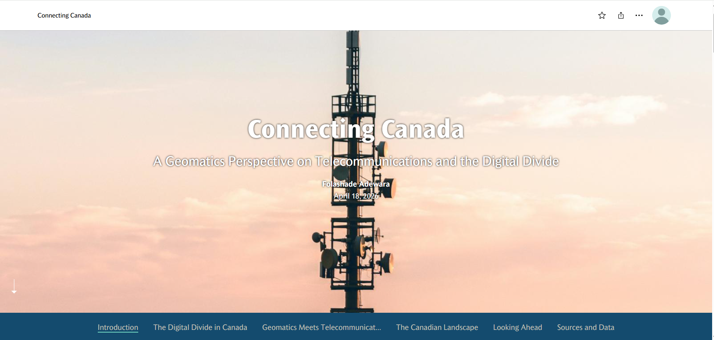
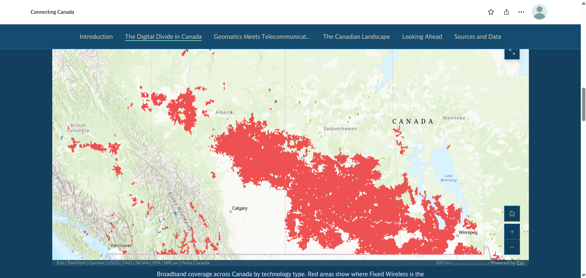
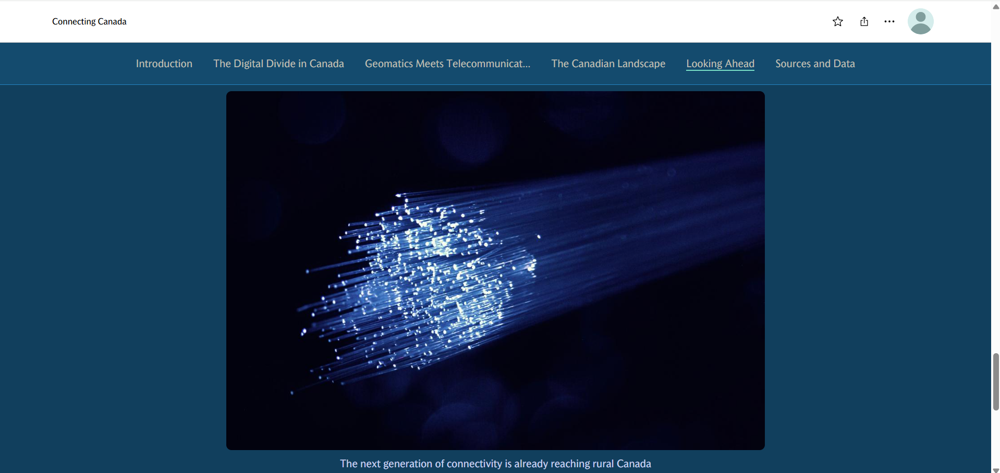

**Skills demonstrated:**
- Spatial data upload and styling in ArcGIS Online
- Narrative storytelling with maps and data
- Use of open government datasets (ISED, CRTC)
- StoryMaps design and publishing

---

### 2. Access to Schools in Calgary
**Tool:** QGIS
**Topic:** Urban Accessibility Analysis

A 500 metre walking distance analysis showing how much of Calgary 
is within easy reach of a school. Built entirely in QGIS using open 
data from the City of Calgary. Includes buffer analysis, spatial 
intersection, coordinate system reprojection, and a professional 
print layout.

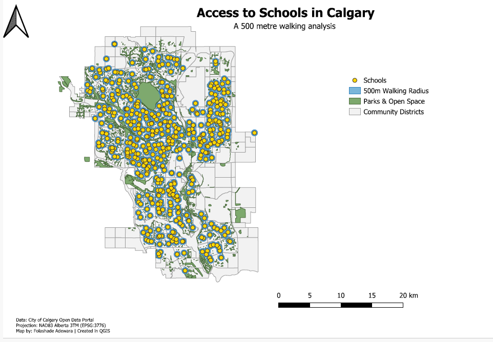

**Skills demonstrated:**
- Data acquisition and organisation
- Coordinate system management (EPSG:3776 NAD83 Alberta 3TM)
- Buffer and intersection analysis
- Cartographic design and print layout
- Workflow documentation

---

### 8. Calgary Spatial Analysis — 9 Geoprocessing Maps
**Tool:** QGIS  
**Topic:** Urban Spatial Analysis Series

A series of 9 spatial analysis maps answering specific geographic 
questions about Calgary using geoprocessing tools including 
intersection, difference, boundary extraction, adjacency analysis 
and hydrological overlay. All built using City of Calgary open 
data and EPSG:3776 coordinate system.

🔗 [View on GitHub](https://github.com/Folashade-Adewara/Calgary-Spatial-Analysis-QGIS)

**Skills demonstrated:**
- Intersection, difference and boundary extraction
- Hydrological and natural area overlay
- Adjacency and proximity analysis
- Multi-layer geoprocessing workflows
- Calgary open data integration

---

### 3. Flight Delay Analysis — MSP Airport
**Tool:** ArcGIS Dashboards
**Topic:** Aviation Data Analysis

An interactive dashboard analysing flight delays, cancellations, and 
diversions at Minneapolis-St. Paul International Airport. Includes 
five indicator elements, a serial chart, a delay reason table, and 
a route map. Configured with category and date selectors for dynamic 
filtering across all elements.

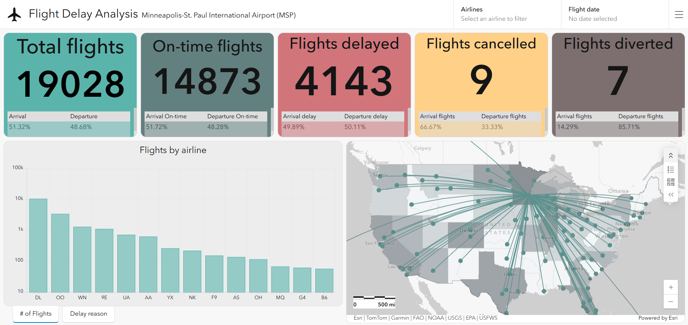
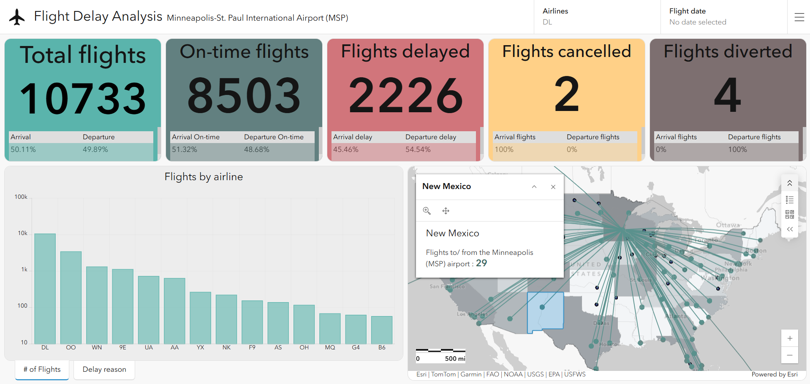

**Skills demonstrated:**
- Dashboard design and layout
- Arcade expression formatting
- Category and date selector configuration
- Map and layer actions
- Splash screen and header configuration

---

### 4. New Orleans Flood Monitoring Dashboard
**Tool:** ArcGIS Dashboards
**Topic:** Emergency Management

A flood awareness dashboard built for the Emergency Operations Center 
in New Orleans. Displays stream flow levels, weather events, and flood 
control infrastructure in near real time. Includes both a desktop view 
for the EOC and a mobile view for field teams.

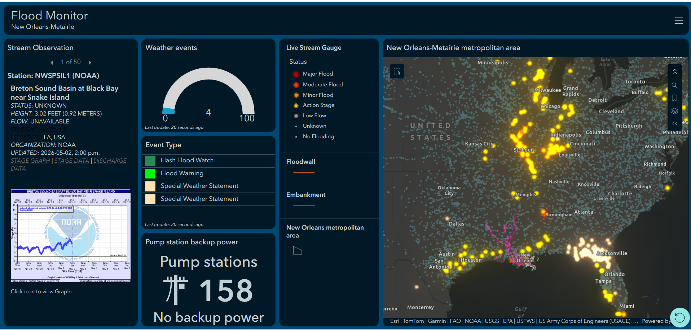

**Skills demonstrated:**
- Multi-view dashboard design (desktop and mobile)
- Map and layer action configuration
- Gauge, list, indicator and details element configuration
- Real-time data integration
- Dashboard sharing and publishing

---

### 5. NSW Wetlands Restoration — Web Experience
**Tool:** ArcGIS Experience Builder
**Topic:** Environmental Research and Public Engagement

A single-page web experience showcasing Hunter Wetlands National Park 
in New South Wales, Australia. Built for stakeholders and the general 
public, the experience includes a feature info panel, bookmark 
navigation, a swipe tool for comparing vegetation layers, map layer 
controls, and a searchable vegetation table.

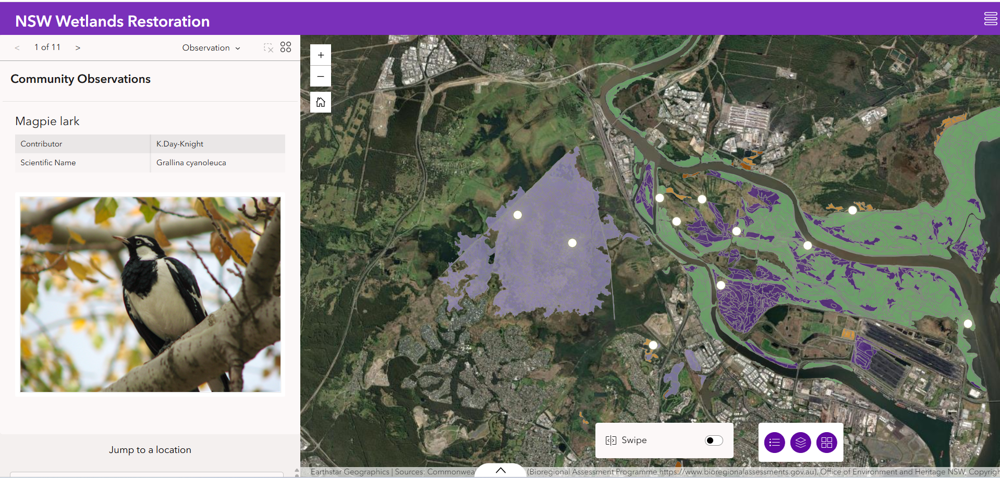
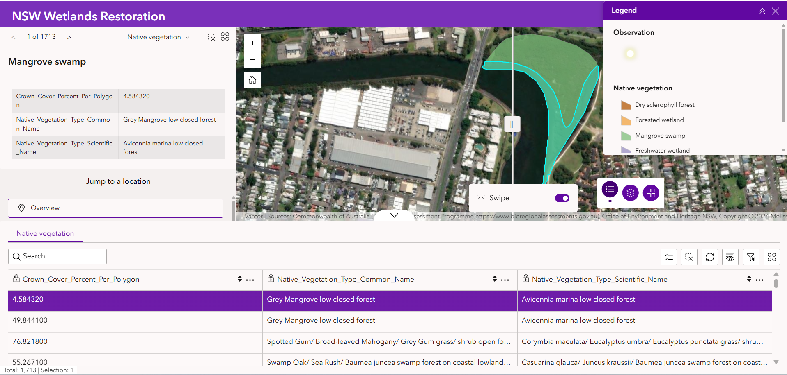

**Skills demonstrated:**
- Template selection and widget configuration
- Feature Info, Bookmark, Swipe, Map Layers and Table widgets
- Widget Controller setup
- Header and menu configuration
- Publishing and sharing settings

---

### 6. Stop, Look, and Listen
**Tool:** ArcGIS StoryMaps
**Topic:** National Park Interpretation

A story map created for the National Park Service highlighting mindful 
walks in Rocky Mountain National Park, Colorado. Includes a cover 
image, audio of a bugling elk, an interactive map tour of the Cub 
Lake Trail, and navigation across four trail sections.

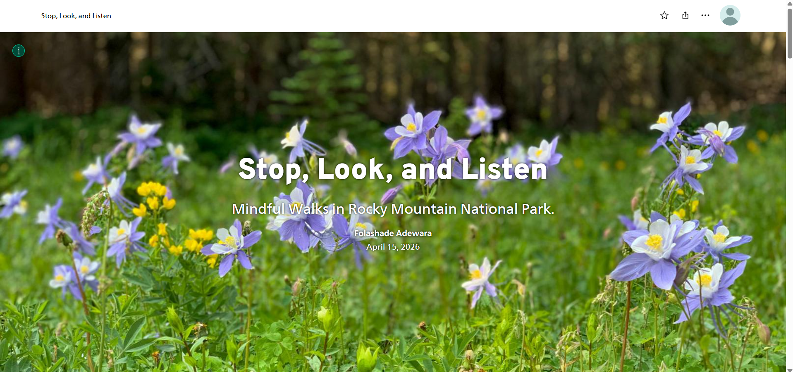
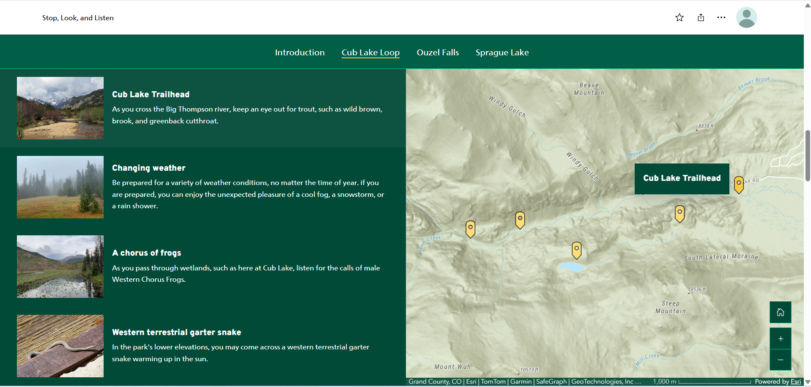

**Skills demonstrated:**
- StoryMaps design and theming
- Audio and image embedding
- Map tour configuration from a feature service layer
- Navigation and section headings
- Publishing and sharing

---

### 7. Explore Cub Lake Trail
**Tool:** ArcGIS StoryMaps Frames
**Topic:** Mobile-First Trail Guide

A short, mobile-first Frames story showcasing the Cub Lake Trail 
in Rocky Mountain National Park. Four slides covering trail stats, 
an interactive map, and wildlife photography. Designed for quick 
consumption on a phone.

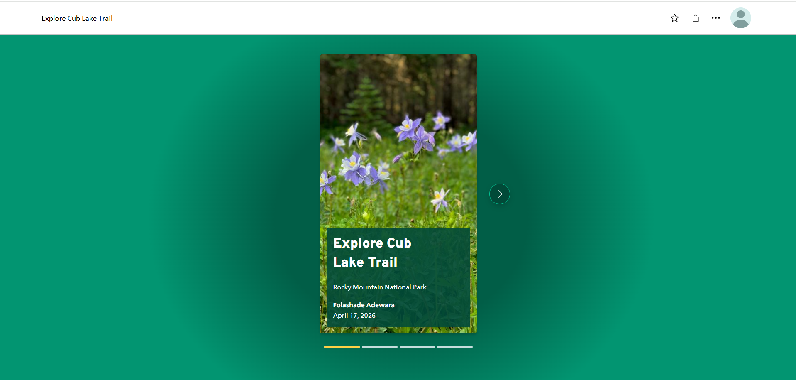
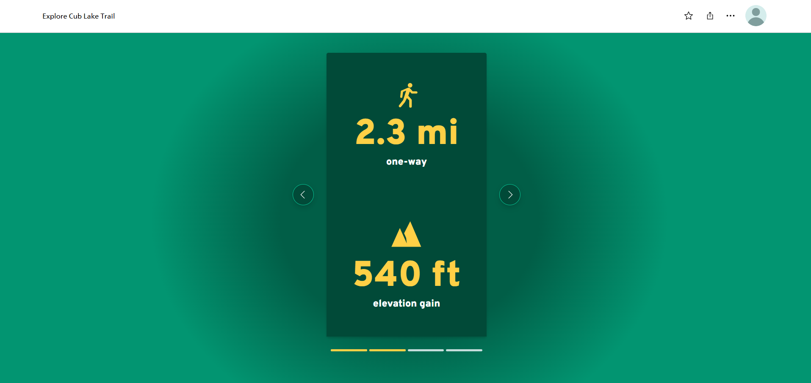
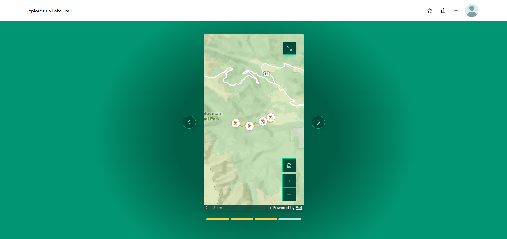

**Skills demonstrated:**
- Frames storytelling format
- Infographic content blocks
- Mobile-first design
- Map integration in a short-form experience

---

## Tools and Technologies

| Tool | Purpose |
|---|---|
| QGIS | Spatial analysis, cartography, data processing |
| ArcGIS Online | Web mapping, data hosting, layer management |
| ArcGIS StoryMaps | Narrative mapping and storytelling |
| ArcGIS Dashboards | Data visualisation and monitoring |
| ArcGIS Experience Builder | Interactive web app development |
| GitHub | Version control and portfolio hosting |

---

## Data Sources Used

- City of Calgary Open Data Portal
- ISED National Broadband Data (open.canada.ca)
- CRTC Broadband Fund Reports
- Esri Training Services (MOOC course data)
- Australian Government Bioregional Assessment Program
- US Bureau of Transportation Statistics

---

## Contact

📧 Connect with me on LinkedIn
🐙 GitHub: Folashade-Adewara

---

*Built as part of the ESRI Make an Impact with Modern GeoApps MOOC 
and through independent personal projects.*
